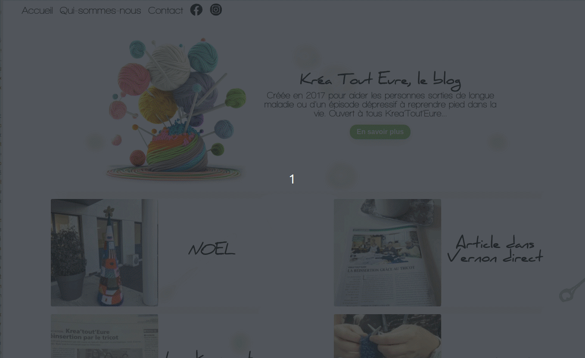

# Blog - Kréa Tout'Eure 

Blog réalisé avec Next.js et Symfony pour l'association Kréa Tout'Eure. Des temps de chargement rapides et une meilleure référencement pour les moteurs de recherche grâce à l'utilisation de Next.js et des outils et bibliothèques pour faciliter le développement grâce à Symfony.

## Table des matières

- [Repository](#repository)
- [Fonctionnalités](#fonctionnalités)
- [Demo](#demo)
- [Ressources](#ressources)
- [Auteurs](#auteurs)

## Fonctionnalités

- Images aux formats Webp
- Optimisation SEO

## Ressources

- [Repository Front-End](https://github.com/MaximeTheneau/Krea-Tout-Eure-Blog-Next.js)

- [Repository Back-End](https://github.com/MaximeTheneau/Krea-Tout-Eure-Blog-Symfony-)

## Demo

### [Demo partie Front ](https://krea-tout-eure.fr)

## Langages utilisés 

- [Next.js](https://nextjs.org/)

- [Symfony](https://symfony.com/)

## Auteurs

* **Theneau Maxime** _alias_ [@MaximeTheneau](https://github.com/MaximeTheneau)
